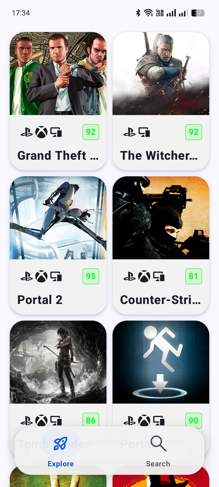
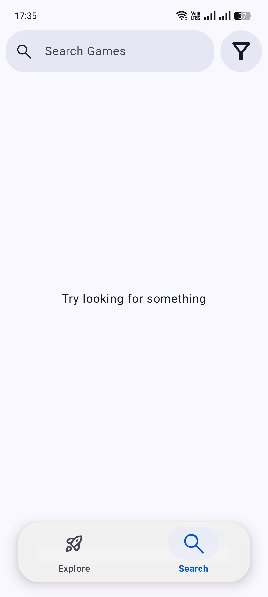
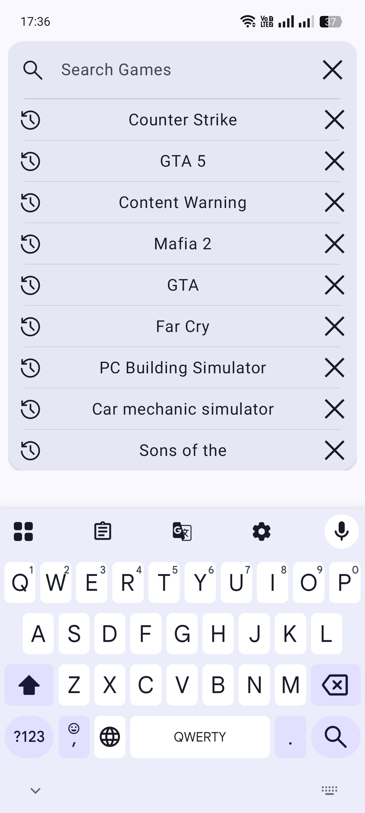
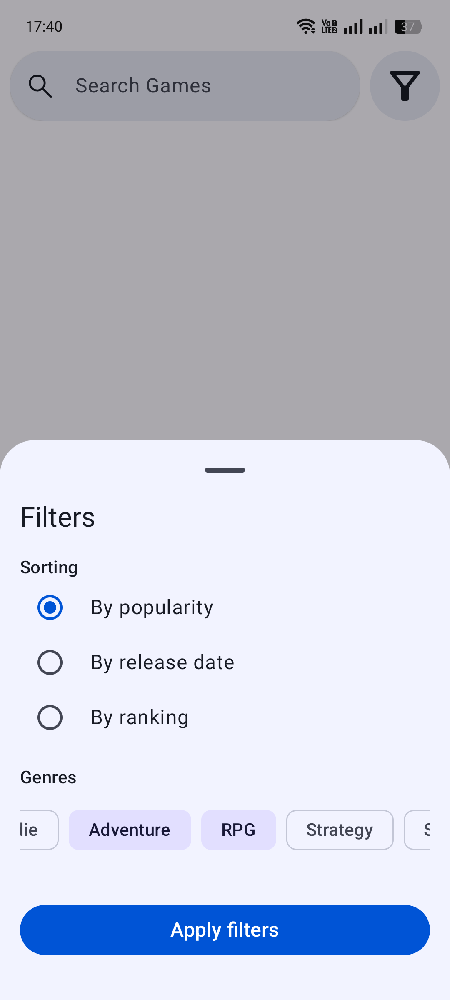
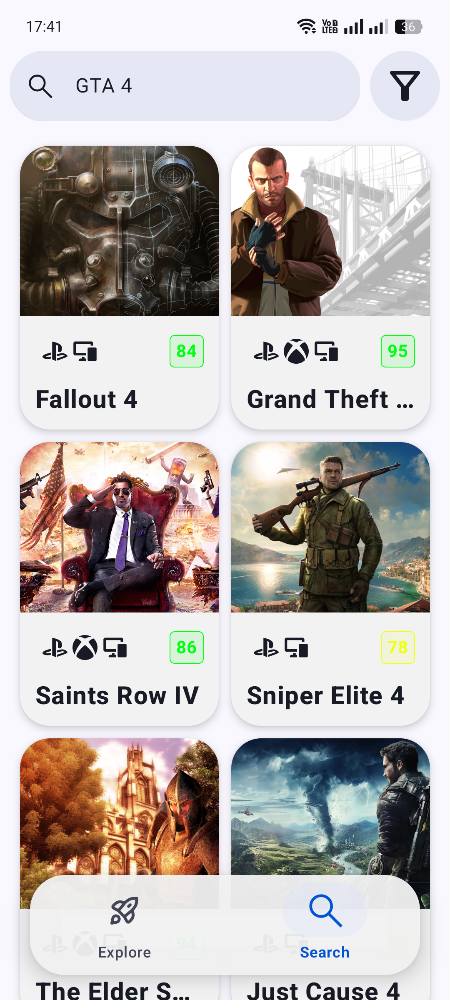
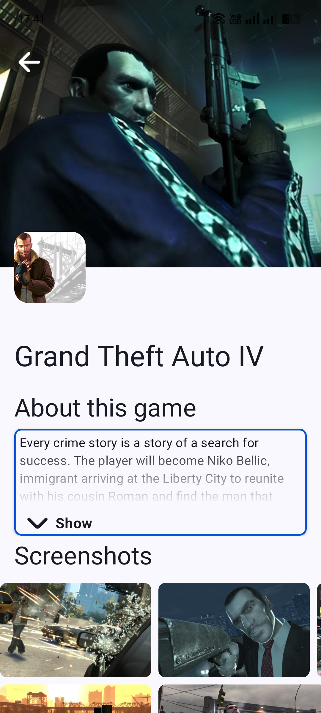
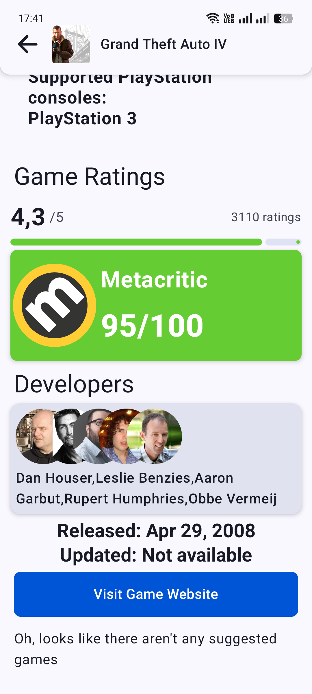

# GameVault 🎮

<div align="center">


</div>

**GameVault** is a modern Android application designed for gamers to discover, search, and explore detailed information about video games. Built with cutting-edge Android technologies following Clean Architecture principles.

## 🚀 Features

- **Explore Games**: Discover popular and trending games on the main dashboard.
- **Deep Search**: Find any game using a powerful search engine powered by the RAWG API.
- **Search History**: Keep track of your previous searches with persistent local storage.
- **Game Details**: View high-quality screenshots, descriptions, ratings, and development team information.
- **Game Suggestions**: Discover similar titles through the "Suggested Games" feature.
- **Shared Element Transitions**: Smooth and immersive transitions when moving between screens.
- **Custom UI Components**: Beautifully crafted animations and a custom-designed bottom navigation bar.

## 📱 Screenshots

<div align="center">
  <table>
    <tr>
      <td></td>
      <td></td>
      <td></td>
    </tr>
    <tr>
      <td align="center"><b>🏠 Home</b></td>
      <td align="center"><b>🔍 Search</b></td>
      <td align="center"><b>🔎 Expanded Search</b></td>
    </tr>
    <tr>
      <td></td>
      <td></td>
      <td></td>
    </tr>
    <tr>
      <td align="center"><b>⚙️ Filters</b></td>
      <td align="center"><b>📋 Results</b></td>
      <td align="center"><b>🎮 Details</b></td>
    </tr>
    <tr>
      <td colspan="3" align="center">
        
        <br><b>⭐ Metacritic & Developers</b>
      </td>
    </tr>
  </table>
</div>

## 🛠 Tech Stack

<div align="center">

### 🏗 **Architecture & Patterns**


### 🖼 **UI & Animations**


### 🔧 **DI & Networking**


### 🗄 **Database & Caching**


### ⚙️ **Plugins & Tools**


</div>

---

## 📋 Development Environment

| Component | Version |
|-----------|---------|
| **Android Studio** | Quail 1 (2025.1.3) or newer |
| **Gradle** | 8.9 |
| **JDK** | 17 or 21 |
| **Kotlin** | 2.4.0 |
| **Min SDK** | 24 (Android 7.0) |
| **Target SDK** | 36 (Android 16) |
| **Compile SDK** | 37 (Android 16) |

---

## 🔑 Setup Guide

### 1. Get RAWG API Key
Register at [RAWG.io](https://rawg.io/apidocs) and obtain your API key.

### 2. Create Local Configuration
Create `local.properties` in the project root:

```properties
RAWG_API_KEY=your_api_key_here
```

### 3. Enterprise API Configuration (Optional)
If you have an Enterprise RAWG account, modify `build.gradle.kts`:

```kotlin
val isEnterpriseApiUser = true
```

**Note:** For standard accounts, replace the `games/{id}/suggested` endpoint with `games/{id}/game-series` in `RawgApi.kt`.

### 4. Sync & Build
```bash
./gradlew build
# Or use Android Studio: File → Sync Project with Gradle Files
```

---

## 🚀 Building & Running

### From Android Studio

1. Open project in Android Studio Quail 1+
2. Wait for Gradle sync to complete
3. Select emulator or physical device
4. Hit **Run** ▶️

### APK (Release Build)

```bash
./gradlew assembleRelease
```

APK location: `app/build/outputs/apk/release/`

### Running Tests
```bash
# Unit tests
./gradlew testDebugUnitTest
```

Automated testing on every push and PR:

<div align="center">

| Platform | Status |Description |
|----------|--------|------------|
|GitHub Actions |  | Runs tests on push to master & PR |
| GitLab CI |  | Mirror from GitHub with test execution |

</div>

## 📄 License

This project is licensed under the GPL-2.0 License - see the [LICENSE](LICENSE) file for details.

---

<div align=center>
 <h3> Built with ❤️ and Jetpack Compose </h3>
</div>
